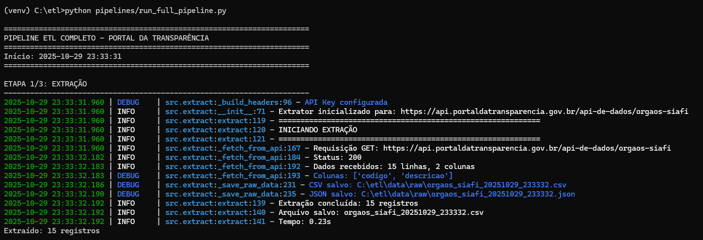
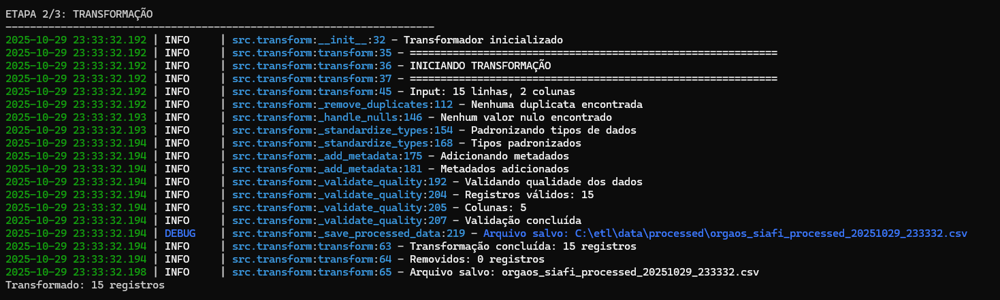
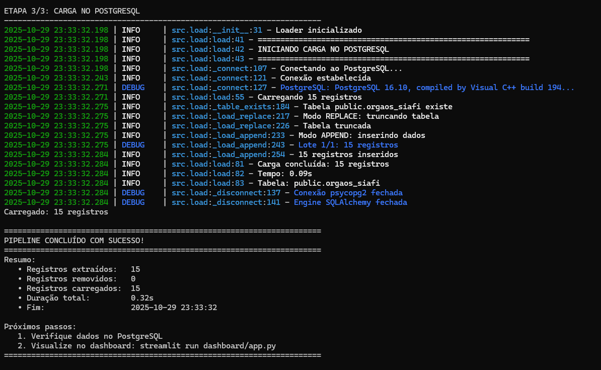
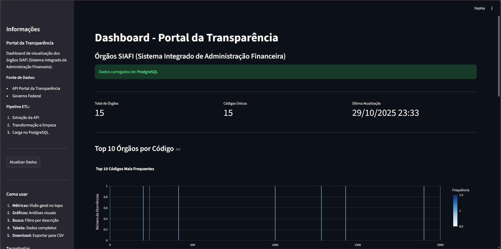

## Pipeline ETL - Portal da Transparência
<div align="center">


### Pipeline ETL profissional para extração, transformação e análise de dados públicos do Governo Federal
<a href="#instalação"></a>
<a href="#como-usar"></a>
<a href="#estrutura-do-projeto"></a>
<a href="#documentação-dos-módulos"></a>

</div>

### Sobre o Projeto:
Este projeto implementa um pipeline ETL (Extract, Transform, Load) completo para coletar e analisar dados dos órgãos do SIAFI (Sistema Integrado de Administração Financeira do Governo Federal) através da API do Portal da Transparência.

### Objetivos:
```
- Automatizar coleta de dados públicos
- Aplicar boas práticas de Engenharia de Dados
- Garantir qualidade e confiabilidade dos dados
- Facilitar análise através de dashboard interativo
```
### Tecnologias Utilizadas:
```
--------------------------------------------------------------------------------------
| Categoria     | Tecnologia                       | Uso                             |
--------------------------------------------------------------------------------------
| Linguagem     | Python 3.12                      | Desenvolvimento do pipeline     |
| Extração      | Requests                         | Consumo de API REST             |
| Transformação | Pandas, NumPy                    | Manipulação e limpeza de dados  |
| Carga         | PostgreSQL, SQLAlchemy, psycopg2 | Armazenamento persistente       |
| Visualização  | Streamlit, Plotly                | Dashboard interativo            |
| Logs          | Loguru                           | Rastreamento de execução        |
| Config        | python-dotenv                    | Gestão de credenciais           |
--------------------------------------------------------------------------------------
```

### Arquitetura do Pipeline:
```
graph LR
    A[API Portal da Transparência] -->|Extract| B[Dados Brutos]
    B -->|Transform| C[Dados Limpos]
    C -->|Load| D[PostgreSQL]
    D -->|Visualização| E[Dashboard Streamlit]
    
    style A fill:#e1f5ff
    style B fill:#fff9c4
    style C fill:#c8e6c9
    style D fill:#f8bbd0
    style E fill:#d1c4e9
```

### Fluxo de Dados

1. **Extract (Extração)**: Coleta dados da API pública do governo
2. **Transform (Transformação)**: Limpa, valida e enriquece os dados
3. **Load (Carga)**: Persiste no PostgreSQL com controle transacional
4. **Visualização**: Dashboard interativo para análise

---

## Estrutura do Projeto
```
pipeline-etl-portal-da-transparencia/
│
├── .env                          # Credenciais originais
├── .env.example                  # Exemplo de credenciais
├── .gitignore                    # Arquivos sencíveis que o Git deve ignorar
├── requirements.txt              # Bibliotecas para instalação
├── README.md                     # Documentação do projeto (Ainda sendo escrita...)
│
├── config/
│   └── settings.py               # Configurações centralizadas
│
├── data/                         # Dados salvos (ignore esta pasta no Git)
│   ├── raw/                      # Dados brutos da API
│   ├── processed/                # Dados limpos
│   └── logs/                     # Logs de execução
│
├── src/                          # Código-fonte principal
│   ├── __init__.py               # Torna 'src' um pacote Python
│   ├── extract.py                # Etapa 1: Extração
│   ├── transform.py              # Etapa 2: Transformação
│   └── load.py                   # Etapa 3: Carga
│
├── pipelines/
│   ├── run_extract.py            # Executa só extração
│   ├── run_transform.py          # Executa só transformação
│   ├── run_load.py               # Executa só carga
│   └── run_full_pipeline.py      # Executa tudo junto
│
├── dashboard/
    └── app.py                    # Dashboard Streamlit
```

## Instalação 

### Pré-requisitos:
```
Python 3.11+
PostgreSQL 12+
Git
```
### Passo a Passo
```
# 1. Clone o repositório
git clone https://github.com/yurivski/Pipeline-ETL-Portal-da-Transparencia.git

cd portal-transparencia-etl

# 2. Crie e ative o ambiente virtual
python -m venv venv

# Windows
venv\Scripts\activate

# Linux/Mac
source venv/bin/activate

# 3. Instale as dependências
pip install -r requirements.txt

# 4. Configure as variáveis de ambiente
cp .env.example .env

# Edite o arquivo .env com suas credenciais
```

### Configuração do .env (exemplo)
```
# API Portal da Transparência
API_URL=https://api.portaldatransparencia.gov.br/api-de-dados
API_KEY=                          

# PostgreSQL
DB_HOST=localhost
DB_PORT=5432
DB_NAME=transparencia_db
DB_USER=postgres
DB_PASSWORD=sua_senha_aqui
DB_SCHEMA=public
DB_TABLE=orgaos_siafi

# Paths
DATA_RAW_PATH=data/raw
DATA_PROCESSED_PATH=data/processed
LOG_PATH=data/logs
```

### Configuração do Banco de Dados
```
Conecte ao PostgreSQL e crie o banco:
CREATE DATABASE transparencia_db;

O pipeline cria a tabela automaticamente na primeira execução
```

## Como Usar
### Opção 1: Pipeline Completo (Recomendado)

Execute todas as etapas de uma vez:
```
python pipelines/run_full_pipeline.py
```

## Opção 2: Etapas Individuais
### Etapa 1: Extração
```
python pipelines/run_extract.py
```
### O que faz:
```
• Conecta na API do Portal da Transparência
• Extrai dados dos órgãos SIAFI
• Salva dados brutos em data/raw/
• Gera logs em data/logs/
```
### Saída esperada:



### Etapa 2: Transformação
```
python pipelines/run_transform.py
```

### O que faz:
```
• Carrega dados brutos mais recentes
• Remove duplicatas
• Trata valores nulos
• Padroniza tipos de dados
• Valida qualidade
• Adiciona metadados
• Salva dados limpos em data/processed/
```
### Saída esperada:



### Etapa 3: Carga

```
python pipelines/run_load.py
```

### O que faz:
```
• Conecta no PostgreSQL
• Cria tabela se não existir
• Carrega dados com controle transacional
• Garante consistência (ACID)
```

### Saída esperada:



## Dashboard Interativo
### Após executar o pipeline, visualize os dados:

```
streamlit run dashboard/app.py
```

### O dashboard abrirá automaticamente em: http://localhost:8501
### Preview:



### Funcionalidades do Dashboard
```
• Métricas principais: Total de órgãos, códigos únicos, última atualização
• Gráficos interativos: Top 10 órgãos por frequência
• Busca em tempo real: Filtro por descrição
• Tabela completa: Todos os dados com ordenação
• Download CSV: Exportação dos dados filtrados
• Estatísticas: Qualidade e métricas dos dados
```

## Schema dos Dados
### Fonte: API Portal da Transparência:
### Endpoint: ```GET /api-de-dados/orgaos-siafi```
### Tabela: ```orgaos_siafi```
```
----------------------------------------------------------------------------------------
| Coluna          | Tipo        | Descrição               | Exemplo                    |
----------------------------------------------------------------------------------------
| codigo          | STRING      | Código do órgão SIAFI   | "26000"                    |
| descricao       | STRING      | Nome oficial do órgão   | "Ministério da Educação"   |
| data_extracao   | TIMESTAMP   | Data/hora da extração   | "2024-01-15 14:30:00"      |
| fonte           | STRING      | Origem dos dados        | "Portal da Transparência"  |
| versao_pipeline | STRING      | Versão do pipeline ETL  | "1.0.0"                    |
----------------------------------------------------------------------------------------
```

### Conceitos Aplicados:
### Extract (Extração)
```
• Requisições HTTP com tratamento de erros
• Headers customizados e autenticação
• Timeout e retry automático
• Salvamento em múltiplos formatos (CSV, JSON)
• Metadados de execução
```

### Transform (Transformação)
```
• Remoção de duplicatas
• Tratamento de valores nulos
• Padronização de tipos (type casting)
• Validação de qualidade (assertions)
• Enriquecimento com metadados
• List comprehensions para eficiência
```

### Load (Carga)
```
• Connection pooling
• Transações ACID
• Modos de carga (replace, append, upsert)
• Batch loading otimizado
• Rollback automático em caso de erro
• Criação automática de tabelas
```

## Documentação dos Módulos
```config/settings.py```

Gerencia todas as configurações do projeto:
```
# Carrega variáveis do .env
API_URL = os.getenv("API_URL")
DB_CONFIG = {...}
PROJECT_ROOT = Path(__file__).parent.parent

# Valida configurações obrigatórias
validate_config()
```
---
```src/extract.py```

Classe ```APIExtractor```:

````
extract(): Método principal de extração
_fetch_from_api(): Requisição HTTP
_save_raw_data(): Persistência dos dados brutos
````
---
``src/transform.py`` 

Classe ``DataTransformer``:
````
transform(): Método principal de transformação
_remove_duplicates(): Remove registros duplicados
_handle_nulls(): Trata valores ausentes
_standardize_types(): Padroniza tipos de dados
_add_metadata(): Adiciona colunas de metadados
_validate_quality(): Validações de qualidade
````
---
``src/load.py``

Classe ``PostgresLoader``:

````
load(): Método principal de carga
_connect(): Estabelece conexão com PostgreSQL
_load_replace(): Modo TRUNCATE + INSERT
_load_append(): Modo INSERT
_load_upsert(): Modo INSERT ON CONFLICT UPDATE
````
---
``dashboard/app.py``

Funções principais:
````
load_data_from_db(): Carrega do PostgreSQL (com cache)
create_metrics_cards(): Cards de métricas
create_bar_chart(): Gráfico de barras interativo
create_search_filter(): Filtro de busca
create_download_button(): Exportação CSV
````

## Comandos Úteis
### Ambiente Virtual

```
# Ativar
venv\Scripts\activate          # Windows
source venv/bin/activate       # Linux/Mac

# Desativar
deactivate
```

### Logs

```
# Ver logs mais recentes (Windows)
type data\logs\*.log | more

# Ver logs mais recentes (Linux/Mac)
tail -f data/logs/*.log

# Buscar por erros
grep -i "error" data/logs/*.log
```

### PostgreSQL

```
# Conectar via psql
psql -U postgres -d nome_do_seu_db.db

# Verificar dados
SELECT COUNT(*) FROM public.orgaos_siafi;
SELECT * FROM public.orgaos_siafi LIMIT 10;

# Limpar tabela
TRUNCATE TABLE public.orgaos_siafi;
```

## Licença
#### Este projeto está sob a licença MIT. Veja o arquivo ***LICENSE*** para mais detalhes.
---


#### Autor: ````Yuri Pontes | Engenheiro de dados Júnior````


<div align="center">
Se este projeto te ajudou, deixe uma estrela!
</div>
